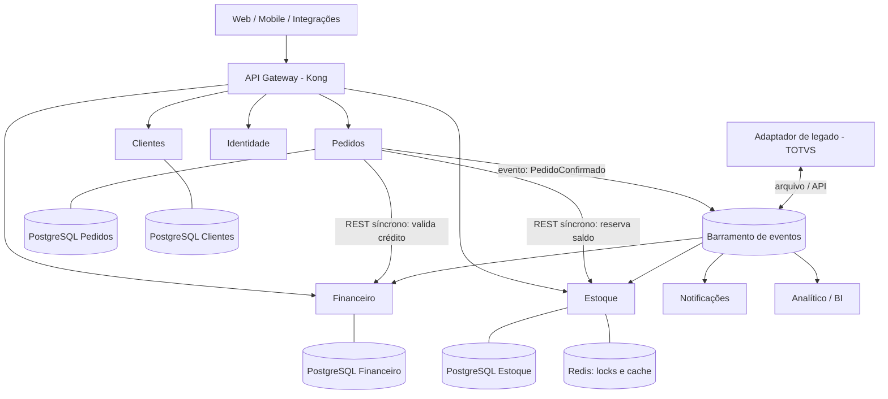

# Questão 1 — Arquitetura do módulo de Pedidos e Estoque

## Antes da divisão: o que um ERP tem de diferente

Arquitetura de microsserviços costuma ser discutida com exemplos de e-commerce,
onde o pior caso é uma tela desatualizada. Em ERP o pior caso é outro: **estoque
que diverge do físico, título financeiro duplicado e nota fiscal emitida com
valor errado**. São erros que viram prejuízo contábil e trabalho manual de
conferência — e que geram desconfiança permanente no sistema.

Isso muda três decisões logo de saída:

1. **Consistência forte onde há dinheiro e saldo**, eventual só onde o negócio
   tolera. Reserva de estoque e baixa financeira não são "eventualmente
   consistentes"; relatório gerencial e índice de busca são.
2. **Rastreabilidade é requisito, não observabilidade.** Auditoria fiscal pergunta
   quem mudou o quê e quando, anos depois.
3. **Sempre existe integração legada.** Todo ERP real conversa com algo que não se
   pode mudar — no meu caso foi o TOTVS Datasul. A arquitetura precisa de um
   lugar previsto para o legado, senão ele se infiltra em todos os serviços.

## Uma ressalva honesta sobre a premissa

O enunciado já define microsserviços, e é sobre isso que respondo abaixo. Mas se
a decisão ainda estivesse aberta, eu defenderia começar como **monólito modular**
— módulos com fronteira explícita, banco único, deploy único — e extrair
serviços quando aparecer uma razão concreta: um módulo que precisa escalar
sozinho, um time que precisa de ciclo de release próprio, ou um requisito de
isolamento.

O motivo é experiência, não preferência: a fronteira errada entre serviços custa
muito mais caro para desfazer do que a fronteira errada entre módulos. Num ERP,
onde os contextos se descobrem enquanto o negócio é modelado, errar a fronteira
cedo é a regra.

## Os serviços e suas responsabilidades

| Serviço | Responsabilidade | Por que separado |
|---|---|---|
| **Pedidos** | Ciclo de vida do pedido: rascunho, confirmação, cancelamento, faturamento. Orquestra a saga de venda. | É o contexto com mais regra de negócio e o que mais muda. Precisa de ciclo de release próprio. |
| **Estoque** | Saldo por item e depósito, reserva, movimentação, inventário. | Perfil de carga completamente diferente: leitura intensa e escrita concorrente no mesmo registro. Escala e se tuna sozinho. |
| **Financeiro** | Contas a receber/pagar, limite de crédito, títulos, conciliação. | Fronteira de auditoria e compliance. Isolar reduz o escopo de quem pode tocar em dado financeiro. |
| **Clientes** | Cadastro, endereços, documentos, classificação. | Massa de dados estável, muito lida e pouco escrita — candidato natural a cache agressivo e réplica de leitura. |
| **Identidade** | Autenticação, emissão de token, permissões. | Precisa ser o único emissor de credencial. Espalhar autenticação é como se cria brecha. |
| **Notificações** | E-mail, webhook, mensageria com o cliente final. | Trabalho lento e sujeito a falha externa. Nunca pode estar no caminho de uma venda. |
| **Adaptador de legado** | Anticorrupção: traduz o modelo do ERP legado para os eventos internos. | Ponto único de contágio. Sem ele, o formato do legado vaza para dentro de todos os serviços — e vira dívida permanente. |

A separação **Pedidos / Estoque** merece nota, porque é a mais discutível: os dois
se acoplam num ponto sensível (a reserva de saldo no momento da confirmação). Eu
os mantenho separados porque o perfil de escala é diferente, mas o preço é ter
que resolver a reserva sem transação distribuída — o que trato a seguir.

## Comunicação: quando síncrono, quando assíncrono

A regra que eu uso é simples: **síncrono quando a resposta muda a decisão de quem
está esperando; assíncrono quando é consequência do que já foi decidido.**

### Síncrono (REST), no caminho do usuário

| Chamada | Por quê |
|---|---|
| Pedidos → Financeiro: consulta de limite de crédito | O vendedor precisa saber **agora** se pode vender. Uma resposta que chega depois não serve. |
| Pedidos → Estoque: reserva de saldo | Prometer item que não existe gera cancelamento e desgaste com o cliente. |
| Qualquer serviço → Identidade: validação de token | Precisa acontecer antes de qualquer coisa. |

O custo é acoplamento temporal: se o Financeiro cai, não se vende. Isso se
mitiga com timeout curto, retry com backoff, circuit breaker e uma **política de
degradação decidida pelo negócio** — por exemplo, autorizar venda até um teto
quando o serviço de crédito está indisponível, marcando o pedido para revisão. É
uma decisão de negócio, não de engenharia, e precisa estar escrita.

### Assíncrono (eventos), fora do caminho do usuário

`PedidoConfirmado` é publicado uma vez e consumido por vários interessados:

- **Estoque** converte reserva em baixa efetiva;
- **Financeiro** gera o título a receber;
- **Notificações** avisa o cliente;
- **Analítico** alimenta o BI;
- **Adaptador de legado** espelha no ERP antigo.

O ganho não é performance, é **desacoplamento evolutivo**: quando entrar o
serviço de logística no ano que vem, ele assina o evento e ninguém toca no
serviço de Pedidos. Com REST, cada novo interessado vira uma alteração no
produtor.

### O problema difícil: consistência sem transação distribuída

Confirmar pedido toca três serviços. Two-phase commit está fora — trava recurso e
não sobrevive a partição de rede. A saída é **saga com compensação**:

1. Pedidos cria o pedido como `PENDENTE`;
2. reserva estoque (compensação: liberar reserva);
3. reserva crédito (compensação: estornar);
4. confirma e publica `PedidoConfirmado`.

Falhou no passo 3, executa a compensação do 2. O pedido nunca fica meio
confirmado, e o estado intermediário é explícito no modelo em vez de implícito.

E para o evento não se perder entre o commit e a publicação — a falha clássica,
em que o banco confirma e o broker cai — uso **transactional outbox**: o evento é
gravado na mesma transação do dado, e um publicador separado entrega e marca como
enviado. Com consumidores idempotentes (chave de deduplicação por id do evento),
entrega "ao menos uma vez" é suficiente e muito mais simples de operar do que
"exatamente uma vez".

Foi exatamente aqui que eu mais vi sistema de ERP quebrar na prática: não na
regra de negócio, mas no evento que sumiu ou foi processado duas vezes.

## Onde entram PostgreSQL e Redis

### PostgreSQL — um banco por serviço

Cada serviço é dono do seu banco e ninguém lê a tabela do vizinho. Banco
compartilhado é o atalho que transforma microsserviços num monólito distribuído:
o pior dos dois mundos, porque tem a latência de rede da arquitetura distribuída
e o acoplamento de esquema do monólito.

O que uso do Postgres além de guardar linha:

- **Constraints e checks como última linha de defesa.** Validação de aplicação
  protege do usuário; constraint protege do script de importação e da migração
  mal escrita. Neste projeto isso está em `app/models/product.py`.
- **`SELECT ... FOR UPDATE`** na baixa de estoque, para serializar a escrita
  concorrente no mesmo item.
- **Transações explícitas com escopo curto**, porque transação longa em ERP
  segura lock e derruba a concorrência do fechamento.
- **Réplica de leitura** para relatório pesado, isolando o BI do transacional.
- **Particionamento por período** em tabelas que só crescem (movimentação de
  estoque, log de auditoria).

### Redis — quatro papéis distintos

| Papel | Uso concreto | Observação |
|---|---|---|
| **Cache de leitura** | Cadastro de clientes e produtos, tabela de preço | Implementado neste projeto: cache-aside com invalidação versionada (`app/core/cache.py`) |
| **Lock distribuído** | Garantir que só um worker execute o fechamento de estoque | Com TTL **sempre**: lock sem expiração vira deadlock permanente quando o processo morre segurando a chave |
| **Fila de tarefas** | Alerta de estoque, geração de relatório, envio de e-mail | Implementado com `arq` (`app/workers/`) |
| **Rate limiting e idempotência** | Contador por chave no gateway; chave de deduplicação de evento | Barato e com expiração automática |

**O que eu não colocaria no Redis:** dado que não pode ser perdido. Redis é
memória com persistência opcional — mesmo com AOF há janela de perda. Fila de
e-mail, tudo bem. Fila de emissão de nota fiscal, não: ali vai um broker com
garantia de durabilidade (RabbitMQ, SQS, Kafka) ou o outbox no próprio Postgres.

## O papel do API Gateway (Kong)

O gateway é a **borda única** e existe para tirar dos serviços o que é
infraestrutura repetida:

- roteamento e versionamento de rota;
- validação de JWT antes de chegar no serviço (o serviço ainda revalida — defesa
  em profundidade, porque um atacante que chegue por dentro da rede não passa
  pelo gateway);
- rate limiting e quota por cliente/integração;
- TLS, CORS, compressão;
- correlação: gerar o `X-Request-Id` que amarra o rastro distribuído;
- ponto único de auditoria de quem chamou o quê.

**O que eu não colocaria nele:** regra de negócio, agregação complexa e
transformação de payload. Gateway com lógica vira um monólito escondido, sem
teste e mantido por ninguém. Quando a tela precisa juntar dados de vários
serviços, prefiro um **BFF** — um serviço de verdade, versionado e testável. O
endpoint `/agregado/visao-360` desta prova é justamente um exemplo em miniatura
de agregação feita em serviço, não no gateway.

## Observabilidade

Três sinais, com ferramentas distintas e propósitos distintos:

| Sinal | Ferramenta | Para quê |
|---|---|---|
| **Logs** | JSON estruturado → Loki ou ELK | Investigar um caso específico. Implementado em `app/core/logging.py` |
| **Métricas** | Prometheus + Grafana | Saber que algo está errado antes do cliente ligar |
| **Tracing** | OpenTelemetry + Jaeger/Tempo | Descobrir **qual** dos sete serviços causou a lentidão |

Instrumentaria com **OpenTelemetry** por não amarrar o código a fornecedor: a
instrumentação fica no padrão e o destino se troca por configuração.

### O que eu monitoraria primeiro num ERP

A ordem importa, porque dashboard com trezentos painéis não é monitoramento, é
decoração. Priorizo pelo custo do erro para o negócio:

1. **Profundidade e idade da fila de eventos.** Fila crescendo ou evento velho
   parado significa estoque e financeiro divergindo silenciosamente. É o alarme
   número um de ERP — e o mais ignorado.
2. **Dead letter queue com qualquer item.** Todo item ali é uma operação de
   negócio que não aconteceu.
3. **Taxa de erro e latência p95/p99 por rota**, com alerta em cima do p99 e não
   da média. A média esconde exatamente o cliente que está sofrendo.
4. **Falha de integração com o legado**, separada das demais: é a que mais
   acontece e a que ninguém percebe até o fechamento do mês.
5. **Saúde das dependências**: conexões do pool do Postgres, memória e evicção do
   Redis, lag da réplica.
6. **Métricas de negócio junto das técnicas**: pedidos confirmados por hora,
   valor faturado, reservas expiradas. É o que responde "o sistema está de pé,
   mas alguma coisa parou de funcionar?" — o incidente mais difícil de detectar
   só com métrica técnica.
7. **Divergência de saldo**: comparação periódica entre o saldo do serviço de
   Estoque e o do legado. Reconciliação automática é o que evita descobrir o
   problema no inventário anual.

Sobre alerta: só alarma o que exige ação humana imediata. Alerta que ninguém
trata treina o time a ignorar todos — e o dia em que o importante disparar,
ninguém vai olhar.
