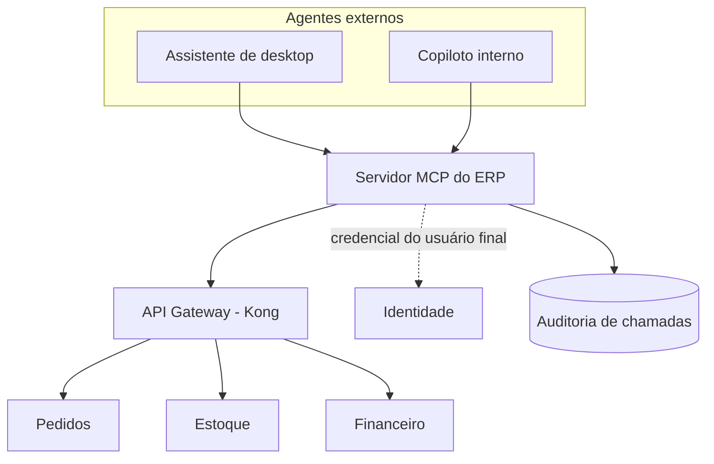

# Questão 9 — Como eu plugaria um LLM real

## O que já está pronto para isso

A Questão 8 foi implementada com a troca em mente. Hoje o fluxo é:

```
pergunta → [PlannerPorRegras] → Interpretacao → [guardrails] → [ferramenta] → resposta
```

Com um LLM, muda **uma caixa**:

```
pergunta → [PlannerLLM] → Interpretacao → [guardrails] → [ferramenta] → resposta
                ↑
        mesmo contrato (Protocol), mesmo JSON Schema, mesmos guardrails
```

Três decisões tomadas agora é que permitem isso:

1. **`Planner` é um `Protocol`** (`app/agent/planner.py`) — não uma classe base
   com implementação. Qualquer objeto com `planejar(pergunta) -> Interpretacao`
   serve.
2. **As ferramentas são declaradas em JSON Schema** (`app/agent/tools.py`), que já
   é o formato de function calling. Nada precisa ser reescrito para o LLM.
3. **Os guardrails vivem no executor, não no planner** (`app/agent/executor.py`).
   A defesa vale para qualquer planner — inclusive um que alucine.

Para ver isso concretamente, com a stack no ar:

```bash
curl -s localhost:8000/agente/ferramentas | python3 -m json.tool
```

O endpoint devolve o mesmo catálogo nos dois formatos: `function_calling` e `mcp`.

## Tool/function calling: o schema exposto ao agente

Cada ferramenta sai pronta para ir no payload do provedor:

```json
{
  "type": "function",
  "function": {
    "name": "consultar_estoque_baixo",
    "description": "Lista os produtos cujo estoque esta igual ou abaixo de um limite. Use quando o usuario perguntar sobre estoque baixo, falta de produto, ruptura ou necessidade de reposicao.",
    "parameters": {
      "type": "object",
      "properties": {
        "limite": {"type": "integer", "minimum": 0, "default": 10}
      },
      "required": [],
      "additionalProperties": false
    }
  }
}
```

Duas escolhas de projeto que fazem diferença na prática:

- **`additionalProperties: false` em todas.** É o que faz a validação rejeitar
  argumento inventado. Sem isso, o schema aceita qualquer campo extra e a
  alucinação passa direto.
- **A descrição é escrita para o modelo, não para o desenvolvedor.** Ela diz
  *quando* usar a ferramenta, com as palavras que o usuário usaria. Descrição
  ruim é a causa número um de escolha errada de ferramenta — e sai muito mais
  barato de corrigir do que trocar de modelo.

O catálogo que eu exporia num ERP completo seria maior: `consultar_estoque`,
`buscar_produtos`, `consultar_pedido`, `criar_pedido`, `consultar_titulos`,
`consultar_cliente`. Note a assimetria proposital: **muitas ferramentas de
leitura, pouquíssimas de escrita**, e cada escrita com confirmação.

## MCP: usaria, com uma fronteira clara

**Sim, e para um caso específico:** expor as capacidades do ERP a agentes de
terceiros — assistente de desktop, copiloto interno, automação de outro time.
O ganho do MCP é padronização: escreve-se o servidor uma vez e qualquer cliente
compatível consome, sem integração ponto a ponto.

**Onde eu *não* usaria:** no agente do próprio produto. Se o backend do ERP já
tem as ferramentas em processo, mandar a chamada dar a volta por um servidor MCP
adiciona um salto de rede, um ponto de falha e latência, sem ganho nenhum. MCP é
protocolo de **interoperabilidade**; para consumo interno, chamada direta.

### Onde o servidor MCP entra na arquitetura da Parte 1



Quatro decisões nesse desenho:

1. **Um servidor MCP, não um por microsserviço.** Um por serviço multiplicaria o
   número de catálogos, de superfícies de autenticação e de pontos de auditoria.
   O servidor MCP é um **agregador na borda**, no mesmo nível do gateway.

2. **Ele não fala com banco.** Consome os mesmos serviços de domínio que a API
   web consome. Se falasse direto com o banco, teríamos duas implementações da
   mesma regra de negócio — e uma delas ficaria desatualizada.

3. **Ele propaga a identidade do usuário final.** Este é o ponto de segurança
   mais importante de agente sobre ERP, e o mais fácil de errar: é tentador dar
   ao servidor MCP um token de serviço com permissão total. Aí qualquer usuário,
   via agente, lê a folha de pagamento. A permissão tem que ser a **do usuário
   que fez a pergunta**, avaliada pelos mesmos serviços de sempre.

4. **Toda chamada é auditada** com usuário, ferramenta, argumentos, resultado e
   duração — o mesmo conteúdo da trilha que a resposta do agente já devolve hoje
   no campo `trilha`.

## Guardrails

### Contra ação destrutiva

O princípio: **o agente propõe, o humano dispõe.** Nunca dar ao modelo a
capacidade de causar dano irreversível sozinho.

| Barreira | Como funciona | Onde está hoje |
|---|---|---|
| Lista fechada de ferramentas | Só executa o que está no registro; nunca SQL ou nome de função vindo do texto | `executor.py`, barreira 1 |
| Limiar de confiança | Abaixo do limiar, admite que não entendeu em vez de agir no chute | `executor.py`, barreira 2 |
| Validação por JSON Schema | Argumento inventado ou de tipo errado é barrado antes de virar consulta | `executor.py`, barreira 3 |
| Confirmação explícita | Ferramenta destrutiva devolve a intenção e espera o humano confirmar | `executor.py`, barreira 4 |
| Separação leitura/escrita | Maioria esmagadora das ferramentas é somente leitura | `tools.py` |

O que eu acrescentaria numa versão de produção:

- **Permissão por usuário, não por agente.** A ferramenta só aparece no catálogo
  se aquele usuário poderia executar a ação pela tela. Um agente nunca deve ser
  um caminho para escapar do controle de acesso do ERP.
- **Pré-visualização antes de escrever.** Ação de escrita responde primeiro com
  "isto é o que vai mudar" — o diff — e só executa depois do aceite.
- **Limites materiais.** Teto de linhas afetadas por operação; remoção em massa
  simplesmente não existe como ferramenta. Se não dá para fazer, não dá para
  alucinar.
- **Chave de idempotência** em toda escrita, para que retry do agente não gere
  pedido duplicado.
- **Quarentena para o irreversível.** Exclusão vira inativação com prazo de
  retenção. É a diferença entre um erro que se corrige e um que vira restauração
  de backup.
- **Limite de taxa por usuário**, contra o laço em que o agente repete a mesma
  ação.

### Contra alucinação e erro de interpretação

A defesa estrutural, que vale mais que todas as outras: **o modelo nunca produz
o número**. Ele escolhe qual pergunta fazer ao banco; quem responde é o banco.
Essa separação já está no código — o orquestrador narra a partir do resultado da
ferramenta, nunca a partir de conhecimento próprio. É por isso que o sistema não
tem como inventar um saldo de estoque: ele não tem de onde tirar um.

Somando a isso:

- **"Não sei" é resposta válida e desejável.** O agente devolve
  `nao_compreendido` com sugestões em vez de forçar uma ferramenta. Reformular a
  pergunta custa segundos; agir sobre uma interpretação errada custa muito mais.
- **Devolver a interpretação junto da resposta.** O campo `interpretacao` mostra
  qual ferramenta e quais argumentos foram usados. O usuário percebe na hora se
  a pergunta foi entendida de outro jeito — sem precisar confiar cegamente.
- **Citar a origem.** Toda resposta deveria trazer os ids consultados, para o
  usuário conferir no sistema.
- **Suíte de avaliação com regressão.** Um conjunto de perguntas reais com a
  ferramenta e os argumentos esperados, rodando no CI. Trocar de modelo ou mexer
  num prompt sem isso é mudar comportamento no escuro. Os testes em
  `tests/test_agente.py` já são exatamente esse formato — só falta a versão com
  LLM.
- **Temperatura baixa e saída estruturada.** Para roteamento de ferramenta não se
  quer criatividade.

## Custo, latência e observabilidade

### Custo

O que domina a conta em agente de ERP não é o tamanho da pergunta — é o
**catálogo de ferramentas, que vai junto em toda requisição**. Com 30
ferramentas bem descritas, são milhares de tokens de entrada por pergunta, sendo
que a maioria nunca vai ser usada naquela conversa.

Mitigações, na ordem em que eu aplicaria:

1. **Cache de prompt.** O catálogo é idêntico entre requisições — é o caso ideal.
   Corta a maior parte do custo de entrada.
2. **Catálogo filtrado por contexto e por permissão.** Quem está na tela de
   estoque não precisa das ferramentas do financeiro no prompt.
3. **Roteamento em dois níveis.** Modelo pequeno e barato decide a ferramenta no
   caso comum; modelo grande só entra na pergunta ambígua. É o
   `PlannerHibrido` já previsto no código.
4. **Regras antes do modelo.** As perguntas frequentes de um ERP são
   surpreendentemente repetitivas. O planner determinístico que já existe
   responde a boa parte delas com custo zero — e o LLM fica para a cauda longa.
5. **Cache semântico de respostas**, com cuidado: só para consulta, com TTL
   curto e chave que inclua o usuário. Cachear "meu estoque" entre usuários
   diferentes é vazamento de dado, não otimização.
6. **Orçamento por usuário e por tenant**, com alerta. Sem teto, um laço mal
   feito vira fatura inesperada.

### Latência

Uma chamada de LLM adiciona algo entre centenas de milissegundos e vários
segundos — e o agente muitas vezes precisa de duas (escolher a ferramenta, depois
redigir a resposta com o resultado).

- **Streaming** para o texto: melhora a latência percebida, que é a que o usuário
  sente.
- **Timeout e orçamento de tempo**, exatamente como na Parte 2. A mesma
  `com_resiliencia` serve.
- **Executar as ferramentas em paralelo** quando o modelo pede várias:
  `asyncio.gather`, como na Questão 4.
- **Não usar LLM onde não precisa.** Botão de "estoque baixo" na tela é instantâneo
  e não custa nada.

### Fallback quando o provedor cai

Este projeto já nasce com a resposta: **o `PlannerPorRegras` é o plano B**. Se o
provedor estiver fora do ar, `planner_padrao()` devolve o planner determinístico
e o agente continua atendendo as perguntas mais comuns, em modo degradado, com
uma mensagem honesta sobre a limitação.

É a mesma filosofia da Parte 2: degradar com transparência em vez de devolver
erro. Um ERP que para de funcionar porque um serviço de IA caiu é um ERP que não
deveria ter IA no caminho crítico.

Complementos: circuit breaker para não martelar o provedor caído, e um segundo
provedor atrás da mesma interface para o caso de indisponibilidade prolongada.

### Observabilidade específica de LLM

Além de log, métrica e tracing convencionais:

| O que registrar | Por quê |
|---|---|
| Prompt e resposta completos | Sem isso é impossível investigar por que o agente errou |
| Ferramenta escolhida e argumentos | Onde o erro realmente aparece — quase sempre é escolha de ferramenta, não redação |
| Tokens de entrada/saída e custo por chamada | Custo por usuário e por funcionalidade, para decidir onde otimizar |
| Latência separada: modelo vs ferramenta | Diz se a lentidão é do provedor ou da consulta ao banco |
| Taxa de `nao_compreendido` | Melhor termômetro de qualidade: subiu, algo regrediu |
| Taxa de confirmação recusada | Se o usuário recusa muito, o agente está propondo coisa errada |
| Versão do modelo e do prompt | Sem versionar, nenhuma comparação entre períodos significa nada |

**Cuidado com privacidade:** o prompt de um ERP carrega dado de cliente, preço e
margem. Log de prompt é dado sensível — mascaramento, retenção curta e acesso
restrito, sob as mesmas regras da LGPD que valem para o resto do sistema. E
"não integramos com IAs de terceiros em produção", como a própria prova diz, é
justamente uma resposta defensável para esse risco.
